# Introduction

This repository contains [OpenSCAD](https://openscad.org/) code to generate rectangular grids of hexagons in a form similar to those found in [Kerry Mitchell](https://www.kerrymitchellart.com/)'s 2020 paper, [Generalizations of Truchet Tiles](https://archive.bridgesmathart.org/2020/bridges2020-191.pdf). In that paper, Kerry presented a seemingly simple set of patterns that can be combined in pseudo-random or organized/structured ways to produce interesting patterns:


# Examples

Here are a few examples of grids generated by this program and printed on a [Prusa XL](https://www.prusa3d.com/en/product/original-prusa-xl-assembled-5-toolhead-3d-printer/) using 4 colors:

| TruchetMode(CircledTriad) | TruchetMode(3-4-5-6), Seed(131313) |
| --- | --- |
|  |  |
| **TruchetMode(5),RotateFactor(7),RotateMod(3)** | |
|  | | 

# Features

Here is an incomplete list of program features:

* Generate grids of hexagons suitable for 3D printing as a single "mat" or spaced out for printing on fabric
* Hexagons can be any desired size
* Optional edge around each hexagon
* Grid can be any printable size
* Controlled use of hexagon patterns (also known as arcs in the code)
* Control of borders and corners
* Pseudo-random patterns with control of the random seed
* Predetermined patterns (just one so far)
* Combine multiple mats into a larger design, with edges that interlock properly
* Supports multi-color/multi-extruder printers, one STL per color/extruder

# Getting Started

Install the [latest nightly build](https://openscad.org/downloads.html#snapshots) of OpenSCAD, launch it, and then open the **Preferences**. Click on **Features** and check **object-function**:


Download [hexagons_truchet.scad](hexagons_truchet.scad) and open it in OpenSCAD. Make sure that the OpenSCAD [Customizer](https://en.wikibooks.org/wiki/OpenSCAD_User_Manual/Customizer) is visible, and you are good to go. Simply make a change in the Customizer wait a second, and the display will update.

Now spend the next hour or two experimenting with the various options in the Customizer. When you are ready to create some STL files and slice them for printing, refer to the next section.

# Saving, Loading, and Slicing a Grid

**Important Sanity Tip**: Before you get too far into this adventure, spend some time thinking about and implementing a naming scheme for your configurations, STL files, and GCODE files. If you are using the script below to create multiple mats to form a long and/or wide design, you will end up with 52 STL files per configuration. Good naming, and perhaps a log of your work, will be of immense value here.

After you have designed the grid of your dreams, you are ready to render, save, slice, and print it. To do this you use the **WhichExtruder** item in the Customizer:


Set it to 1, press F6 (Render), wait for the render to finish, then press F7 to save the STL. Repeat this for each extruder. You will end up with four (at most) STL files. 

Now go to your slicer and open all four of the STL files at the same time:


If you are using PrusaSlicer, answer Yes to this question:


This will assign a unique extruder to each of the STL files:


Slice, choose some amazing colors, and print!

Here is the overall flow:

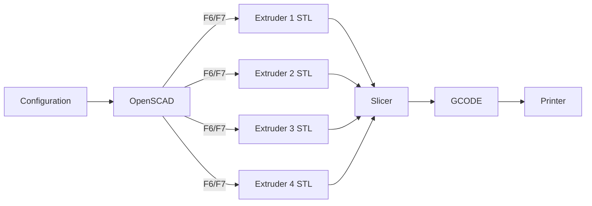


# Options

This section contains a description of each of the items in the Customizer. Once you start using this program in "production mode" and you need to be able to repeat and recall settings on demand, use OpenSCAD's preset menu (if you can figure out how it works :-)), take a screen shot of the Customizer, or capture this line in the Console output:

```
ECHO: { ArcExtruder = 2; ArcHeight = 0.2; ArcWidth = 1.4; CountX = 14; CountY = 17; EdgeExtruder = 4; EdgeHeight = 0.2; EdgeWidth = 1.2; FillExtruder = 3; Gap = 0; HexHeight = 0.4; HexRadius = 13; RandomSeed = 131313; Rotate = true; RotateFactor = 4; RotateMod = 3; TileExtruder = 1; TruchetMode = "5"; XYLabels = false; StartX = 0; LeftBorder = false; RightBorder = false; TopBorder = false; BottomBorder = false; TopLeftCorner = false; TopRightCorner = false; BottomLeftCorner = false; BottomRightCorner = false; }
```
All of the values in the Customizer are represented there. At some point there will be a way to turn this into a preset or a JSON file.

Experiment with all of the items and have a lot of fun as you do so.

## Hexagons

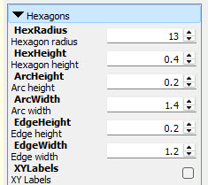

The values in this section control the size and other aspects of each hexagon:

* **HexRadius** - Radius of hexagon. 
* **HexHeight** - Height of hexagon.

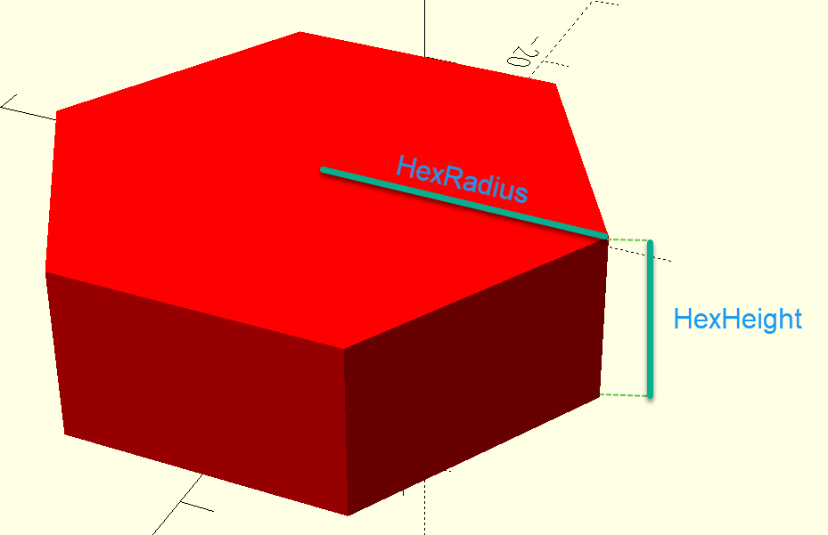 

* **ArcHeight** - Height of the arcs and fill resting on top of hexagon.
* **ArcWidth** - Width of the arcs that are adjacent to the fill.

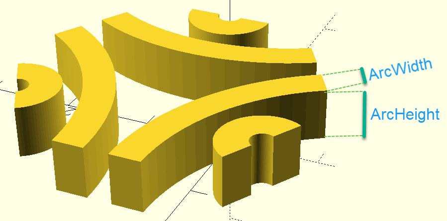

* **EdgeHeight** - Height of the edges around the hexagon.
* **EdgeWidth** - Width of the edges around the hexagon.


* **XYLabels** - If set, renders X/Y coordinates of each hexagon, used for debugging, and also good for developing new patterns:

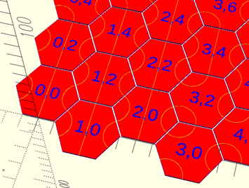
  
## Truchet

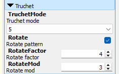

* **TruchetMode** - Controls which of the truchet tiles are used. **1**, **2**, **3**, **4**, **5**, and **6** specify individual tiles. **1-2** specifies tiles 1 and 2, and **3-4-5-6** specifies tiles 3, 4, 5, and 6. **CircledTriad** specifies the circled triad pattern. For modes **1-2** and **3-4-5-6**, **RandomSeed** is used to start the pseudo-random number generator. You will need to capture and retain this value if you are trying to repeat patterns that you created earlier.
* **Rotate** - If set, specifies that tiles should be rotated using a formula based on **RotateFactor** and **RotateMod**. Not all tiles look different when rotated, and this does not apply to the use of **CircledTriad** or (in the future) other patterns.
* **RotateFactor** - Drives the rotation if **Rotate** is set. See the code to learn more.
* **RotateMod** - Also drives the rotation if **Rotate** is set. 

## Grid

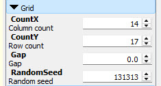

The values in this section control the overall size of the grid of hexagons:

* **CountX** - Specifies the number of hexagons in the X direction.
* **CountY** - Specifies the number of hexagons in the Y direction.
* **Gap** - Specifies the gap between adjacent hexagons. This should be non-zero only if you are [printing on fabric](https://nextjeff.com/3d-printing-on-fabric-tips-and-tricks-f306f4d56833).
* **RandomSeed** - This value is used to seed the random number generator. The values affect **TruchetMode** **1-2** and **3-4-5-6** only.

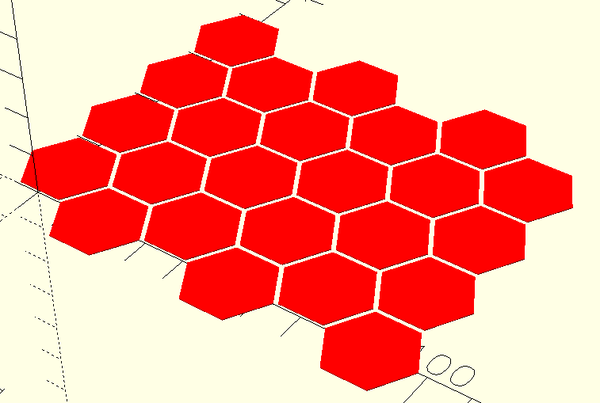

## Mat / Borders / Corners

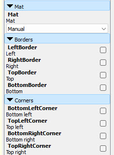

The values in this section control the borders and corners around the grid of hexagons. You can use the **Mat** to choose a predefined collection of settings that will make it easy for you to tile multiple grids into a large mat, or you can set it to **Manual** and control the borders and corners yourself. In most case the first option is easier and preferable. See the section below, **Creating Multi-Print Mats**, to learn more.

* **Mat** - Either **Manual** to enable use of the border and corner controls, or a value **A** through **M** to specify a collection of border and corner settings.

* **LeftBorder** - Enables a border on the left side if set.
* **RightBorder** - Enables a border on the right side if set.
* **TopBorder** - Enables a border on the top edge if set.
* **BottomBorder** - Enables a border on the bottom edge if set.

* **BottomLeftCorner** - Enables a corner on the bottom left if set.
* **TopLeftCorner** - Enables a corner on the top left if set.
* **BottomRightCorner** - Enables a corner on the bottom right if set.
* **TopRightCorner** - Enables a corner on the top right if set.

**Important Safety Tip:** The borders and corners only work properly when **CountX** is odd and **CountY** is even.

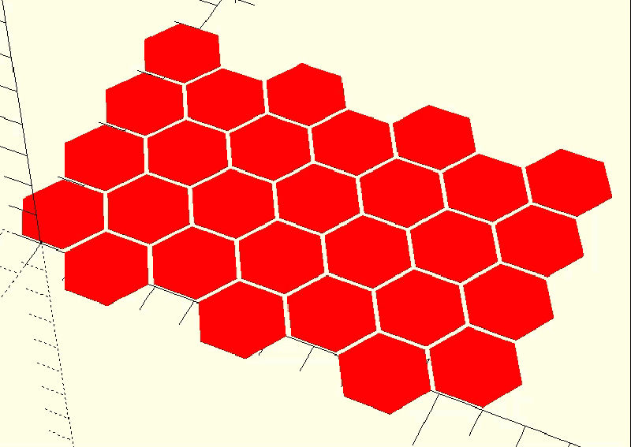

## Extruders

This section lets you create prints that work on multi-color / multi-filament printers. Set **WhichExtruder** to **All** while you are building your grid. Set the four other extruder values as desired (generally keeping them as 1-4 is fine). You can set **FillExtruder** and/or **EdgeExtruder** to 0 if you don't want these elements in your print.

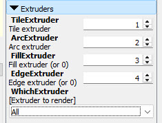

* **TileExtruder** - Sets the extruder for the hexagons. 
* **ArcExtruder** - Sets the extruder for the arcs atop each hexagon.
* **FillExtruder** - Sets the extruder for the area filled in between arcs. 
* **EdgeExtruder** - Sets the extruder for the optional edge around each hexagon.
* **WhichExtruder** - Controls which elements will be displayed and rendered. See my article, [Creating Multi-Extruder Designs in OpenSCAD for 3D Printing](https://nextjeff.com/creating-multi-extruder-designs-in-openscad-for-3d-printing-6c43a002ef64) to learn more about how this works.

# Creating Multi-Print Mats

This feature allows you to easily and efficiently create grids that have the proper combination of borders and edges to seamlessless connect to form arbitrarily long and/or wide mats. There are 13 different settings for **Mat** (**A** through **M**):

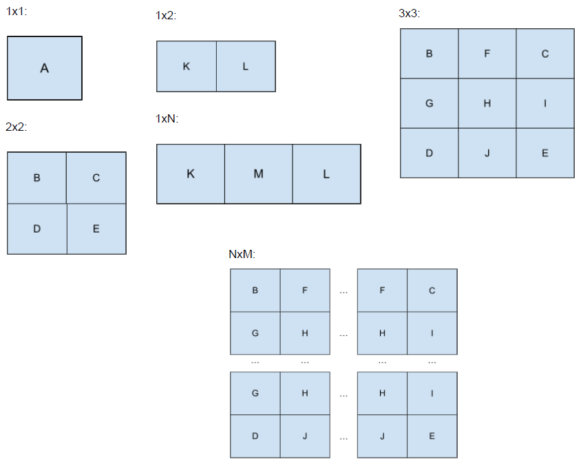

To use this feature, you design your grid as usual, then select one of the Mat values, render for each extruder, and proceed as usual. This will create a lot of files and is very tedious. Fortunately, the next section describes a tool that takes care of all of the repetitive work for you.

# Tools

[render_hexaxgons_truchet.bat](render_hexagons_truchet.bat) in this repo simplifies the process of generating all of the STLs files neded to create a mat. It needs to be hand-edited to set the PARAM and PMAT values, and to be run in a specific directory two levels deeper than where the OpenSCAD file lives. Read the comments in the file to learn more and feel free to make this tool better.

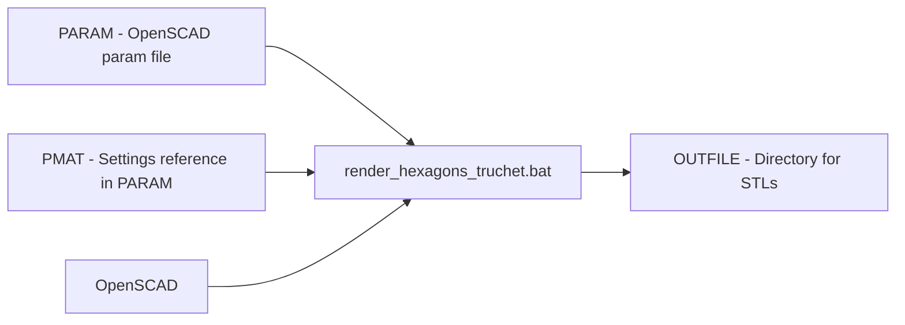

# Ideas

# In The Works

Here's what I am working on or thinking about working on:

* Fixing some bugs
* Adding more patterns
* Ability to create a wall around the entire print
* Ability to leave space for embedded magnets so that mats can snap together

# Please Reference Me / This

If you use this code to create something cool, please reference this page and tag me on social media:

* [Instagram](https://www.instagram.com/jeffbarr/)
* [Threads](https://www.threads.com/@jeffbarr)
* [Facebook](https://www.facebook.com/jeff.s.barr)
* [X](https://x.com/jeffbarr)

# Truchet References

Here are some places to learn more about Truchet and his tiles:

* [Sébastien Truchet](https://en.wikipedia.org/wiki/S%C3%A9bastien_Truchet)
* [Truchet Tiles](https://en.wikipedia.org/wiki/Truchet_tile)
* [The Tiling Patterns of Sebastien Truchet and the Topology of Structural Hierarchy](https://www.jstor.org/stable/1578535?)
* [Generalizations of Truchet Tiles](https://archive.bridgesmathart.org/2020/bridges2020-191.pdf)
* [Regular Truchet tilings](https://peterkagey.com/blog/2021/02/regular-truchet-tilings/) - TBR
* [Too good to be Truchet](https://chalkdustmagazine.com/features/too-good-to-be-truchet/) - TBR
* [Truchet Tilings Revisited](https://www.semanticscholar.org/paper/Truchet-Tilings-Revisited-Krawczyk/8b37239fddfe9f9a9e6b79b5aed41113d0ff2a35) - TBR
* [Truchet Images](https://nedbatchelder.com/blog/202208/truchet_images) - TBR
* [Truchet Tiles: Simple Rules, Infinite Patterns](https://reindernijhoff.net/2019/10/truchet-tiles-simple-rules-infinite-patterns/) - TBR
* [Truchet Tiles and Generalizations](http://drmathart.com/Resources/Truchet/) - TBR
* [Exploring Truchet Tiles and Beyond](https://medium.com/@adbaysal/exploring-truchet-tiles-da61f02981a0) - TBR
* 
