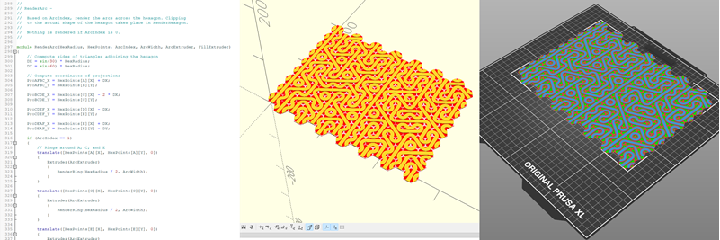

# Introduction

This repository contains [OpenSCAD](https://openscad.org/) code to generate rectangular grids of hexagons in a form similar to those found in [Kerry Mitchell](https://www.kerrymitchellart.com/)'s 2020 paper, [Generalizations of Truchet Tiles](https://archive.bridgesmathart.org/2020/bridges2020-191.pdf). In that paper, Kerry presented a seemingly simple set of patterns that can be combined in presudo-random or organized/structured ways to produce interesting patterns:

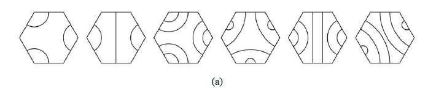

# Examples

Here are a few examples of grids generated by this program and printed on a [Prusa XL](https://www.prusa3d.com/en/product/original-prusa-xl-assembled-5-toolhead-3d-printer/) using 4 colors:

| TruchetMode(CircledTriad) | TruchetMode(3-4-5-6), Seed(131313) |
| --- | --- |
| 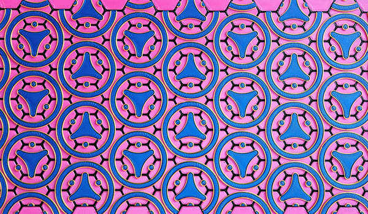 | 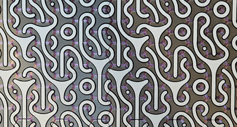 |
| **TruchetMode(5),RotateFactor(7),RotateMod(3)** | |
| 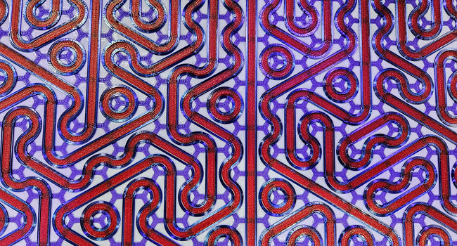 | | 

# Features

Here is an incomplete list of program features:

* Generate grids of hexagons suitable for 3D printing as a single "mat" or spaced out for printing on fabric
* Hexagons can be any desired size
* Optional edge around each hexagon
* Grid can be any printable size
* Controlled use of hexagon patterns (also known as arcs in the code)
* Control of borders and corners
* Pseudo-random patterns with control of the random seed
* Predetermined patterns (just one so far)
* Combine multiple mats into a larger design, with edges that interlock properly
* Supports multi-color/multi-extruder printers, one STL per color/extruder

# Getting Started

Install the [latest nightly build](https://openscad.org/downloads.html#snapshots) of OpenSCAD, launch it, and then open the **Preferences**. Click on **Features** and check **object-function**:

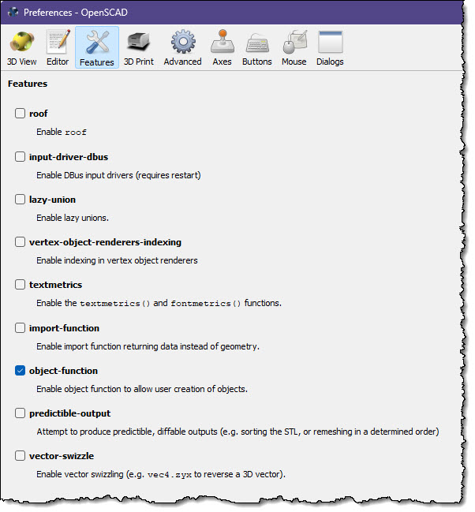

Download [hexagons_truchet.scad](hexagons_truchet.scad) and open it in OpenSCAD. Make sure that the OpenSCAD [Customizer](https://en.wikibooks.org/wiki/OpenSCAD_User_Manual/Customizer) is visible, and you are good to go. Simply make a change in the Customizer wait a second, and the display will update.

Now spend the next hour or two experimenting with the various options in the Customizer. When you are ready to create some STL files and slice them for printing, refer to the next section.

# Saving, Loading, and Slicing a Grid

**Important Sanity Tip**: Before you get too far into this rat-hole, spend some time thinking about and implementing a naming scheme for your configurations, STL files, and GCODE files. If you are using the script below to create multiple mats to form a long and/or wide design, you will end up with 52 STL files per configuration. Good naming, and perhaps a log of your work, will be of immense value here.

After you have designed the grid of your dreams, you are ready to render, save, slice, and print it. To do this you use the **WhichExtruder** item in the Customizer:

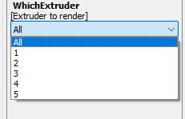

Set it to 1, press F6 (Render), wait for the render to finish, then press F7 to save the STL. Repeat this for each extruder. You will end up with four (at most) STL files. 

Now go to your slicer and open all four of the STL files at the same time:

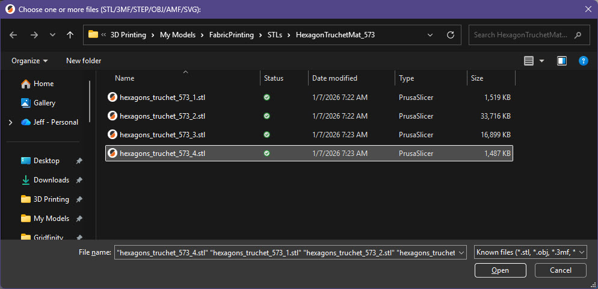

If you are using PrusaSlicer, answer Yes to this question:

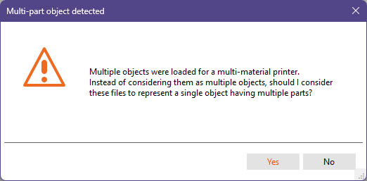

This will assign a unique extruder to each of the STL files:

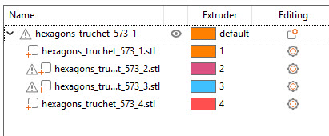

Slice, choose some amazing colors, and print!

Here is the overall flow:

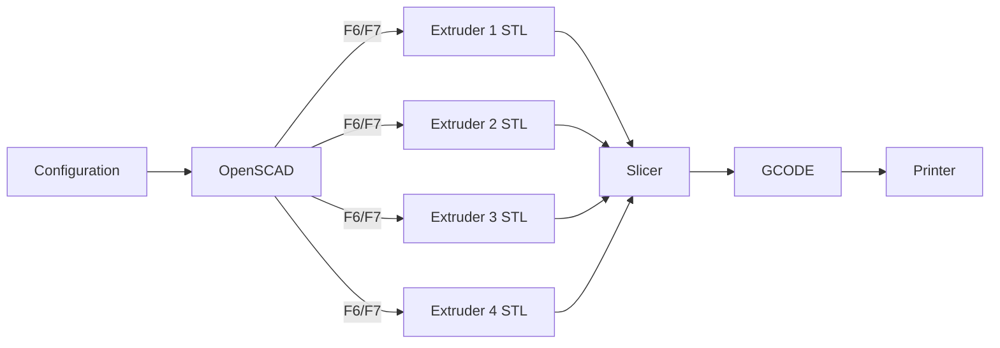

# Options

# Creating Multi-Print Mats

# Tools

# Ideas

# Please Reference Me / This

# Truchet References
